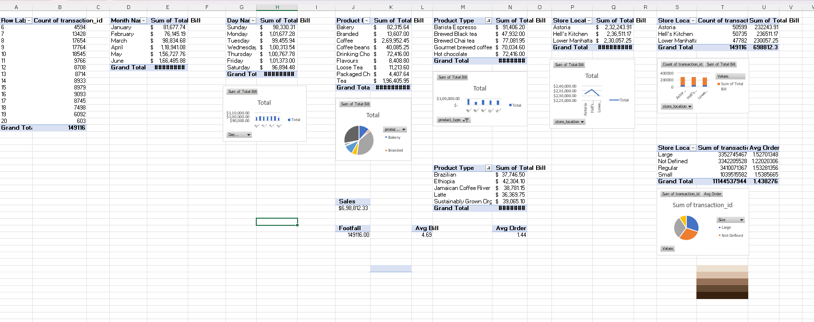
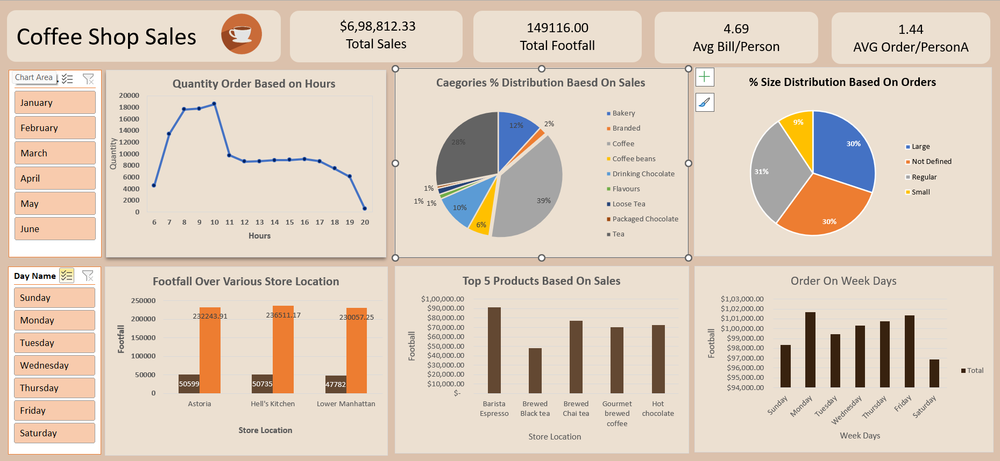

# Coffee-Shop-Sales-Analysis

Using Excel, we're analyzing sales data from a coffee shop to uncover valuable insights aimed at boosting overall business performance. The focus is on identifying customer purchasing patterns, peak shopping times, and store traffic trends. By cleaning and structuring the data, we can explore metrics such as top-selling products, busiest sales hours, and variations in sales across different days, months, and store locations.

## PROBLEM STATEMENT:

Examine sales data and create an interactive dashboard for a coffee shop. The aim is to discover trends, patterns, and insights that support smarter business decisions and drive performance improvements. This involves exploring key elements such as product popularity, peak sales times, and revenue fluctuations to generate actionable insights that can refine and enhance sales strategies.

## RECOMMENDED ANALYSIS:

1.What are the sales patterns across different days of the week and times of day?
2.When do sales typically reach their highest levels?
3.What is the monthly breakdown of total sales revenue?
4.How do sales figures differ between various store locations?
5.What is the average amount spent per order?
6.Which products generate the highest sales in terms of quantity and revenue?
7.How do sales differ based on product categories and sizes?

## CREATE PIVOT TABLES:

Utilized pivot charts to swiftly summarize and analyze data, enabling the rapid identification of trends and patterns. And also by leveraging pivot charts, the process of constructing dynamic dashboards becomes seamless.

## DASHBOARD OVERVIEW:

Crafted an engaging and dynamic dashboard tailored for coffee sales analysis. This interactive platform offers stakeholders a user-friendly interface to explore key metrics, trends, and insights effortlessly.

•	Utilized line charts to visualize sales trends over hours of the day, highlighting peak sales periods and identifying fluctuations in customer demand.

•	Employed horizontal bar charts to depict daily sales performance, enabling easy comparison of sales figures across different days of the week.

•	Utilized pie charts and donut charts to illustrate the percentage distribution of sales based on product sizes and categories, providing a clear visual representation of the contribution of each size and category to overall sales.

•	Implemented column charts to display footfall and sales data for each store location, facilitating comparison of customer traffic and revenue generation across different stores.

### Snapshot

### INSIGHTS:

### Busiest Days and Times: 
•	The busiest hours for coffee sales are between 8:00 AM and 10:00 AM, indicating strong demand during morning rush hours.
•	Mondays and Fridays tend to have the highest sales volumes, indicating increased demand at the beginning and end of the workweek.

### Percentage share based on Size:
•	Large-sized drinks dominate the sales representing the preferred choice among customers while Small-sized drinks are the least contributed.

### Comparable Footfall Distribution:
•	All stores exhibit almost similar level of foot traffic throughout the months, indicating a balanced distribution of customers across different locations. Similar footfall levels present equal opportunities for sales and revenue generation across all stores.

### Percentage share based on Category:
•	Coffee and Tea Categories  account for the largest percentage share of sales which is about 67% with Coffee being the most contributed(39%).

### Top Products
•	Barista Espresso emerges as the best-selling product, reflecting a strong demand for coffee among customers followed by Brewed Chai Tea ranks as the second-highest selling product.

## License

This project is licensed under the [MIT License](LICENSE).
## Author
- <ins><b>©2023 Sujit Roy. All rights reserved</b></ins>
- <b>[LinkedIn](https://www.linkedin.com/in/sujit-roy-399014229/)</b>

